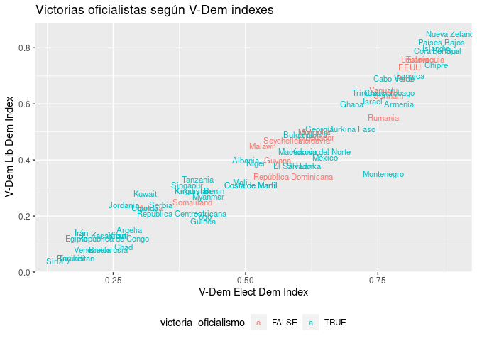
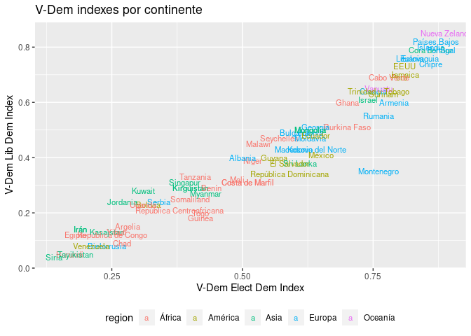
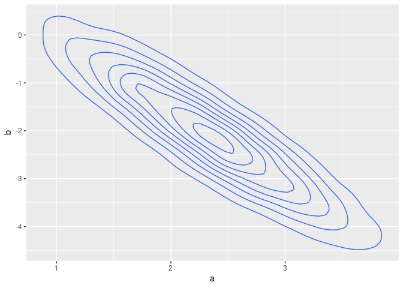
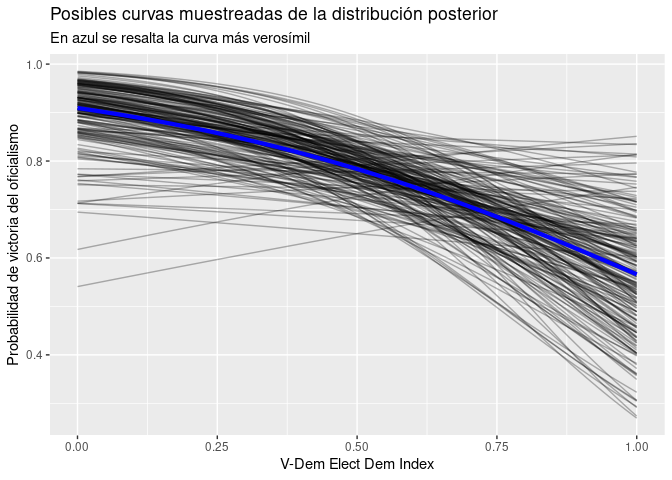

Profit posterior
================
maurogm
2021-06-25

-   [Setup](#setup)
-   [Exploración](#exploración)
-   [Modelado](#modelado)

# Setup

``` r
set.seed(999)
library(tidyverse)
library(data.table)
library(rethinking)
```

Carga de datos:

``` r
df <- readxl::read_xlsx("data/Base Elecciones Covid-19_2020-2021.xlsx",
    skip = 1,
    col_names = c(
        "pais",
        "fecha",
        "region",
        "victoria_oficialismo",
        "tipo_eleccion",
        "vdem_elect_index",
        "vdem_lib_index",
        "vdem_lib_comp",
        "idh",
        "fuente",
        "comentario"
    )
) %>%
    select(-c(comentario, fuente)) %>%
    mutate(victoria_oficialismo = victoria_oficialismo == "Ganó") %>%
    setDT()
```

# Exploración

``` r
df %>%
    ggplot() +
    aes(vdem_elect_index, vdem_lib_index, color = victoria_oficialismo) +
    geom_text(aes(label = pais), size = 3) +
    # facet_wrap(~region) +
    labs(
        title = "Victorias oficialistas según V-Dem indexes",
        x = "V-Dem Elect Dem Index",
        y = "V-Dem Lib Dem Index"
    ) +
    theme(legend.position = "bottom")
```

<!-- -->

Ya que estamos, V-Dem indexes por continente:

``` r
df %>%
    ggplot() +
    aes(vdem_elect_index, vdem_lib_index, color = region) +
    geom_text(aes(label = pais), size = 3) +
    # facet_wrap(~region) +
    labs(
        title = "V-Dem indexes por continente",
        x = "V-Dem Elect Dem Index",
        y = "V-Dem Lib Dem Index"
    ) +
    theme(legend.position = "bottom")
```

<!-- -->

# Modelado

Entreno un modelo logístico de la probabilidad de victoria en función
del V-Dem Elect Dem Index:

``` r
modelo <- quap(
    alist(
        victoria_oficialismo ~ dbinom(1, p),
        logit(p) <- a + b * vdem_elect_index,
        a ~ dnorm(0, 1.5),
        b ~ dnorm(0, 10)
        # sigma ~ dunif(0, 50)
    ),
    data = df[!is.na(vdem_elect_index)]
)
```

La evidencia del efecto negativo del índice electoral sobre las
victorias oficialistas es bastante fuerte (al menos 94.5% de confianza
en que `b` es negativo):

``` r
precis(modelo)
```

    ##        mean       sd      5.5%      94.5%
    ## a  2.306217 0.728538  1.141872  3.4705614
    ## b -2.040059 1.181938 -3.929023 -0.1510944

Densidad posterior de los coeficientes:

``` r
post <- extract.samples(modelo)
post %>%
    ggplot(aes(a, b)) +
    geom_density2d()
```

<!-- -->

Sampleo algunos coeficientes de la distribución posterior, y grafico las
curvas implicadas:

``` r
elect_index_seq <- seq(0, 1, 0.01)

logistic <- function(x) 1 / (1 + exp(-x))

a_mean <- precis(modelo)$mean[1]
b_mean <- precis(modelo)$mean[2]

n_samples <- 200
sample(1:nrow(post), size = n_samples) %>%
    post[., ] %>%
    mutate(sample_id = 1:n_samples) %>%
    crossing(data.table(vdem_elect_index = elect_index_seq)) %>%
    mutate(p_estimation = logistic(a + b * vdem_elect_index)) %>%
    ggplot() +
    geom_line(aes(vdem_elect_index, p_estimation, group = sample_id), alpha = 0.3) +
    geom_function(
        fun = function(x) logistic(a_mean + b_mean * x),
        color = "blue", size = 1.5
    ) +
    labs(
        title = "Posibles curvas muestreadas de la distribución posterior",
        subtitle = "En azul se resalta la curva más verosímil",
        x = "V-Dem Elect Dem Index",
        y = "Probabilidad de victoria del oficialismo"
    )
```

<!-- -->

Se ve que la tendencia decreciente es clara, aunque todavía hay bastante
incertidumbre respecto a la forma de la curva.
